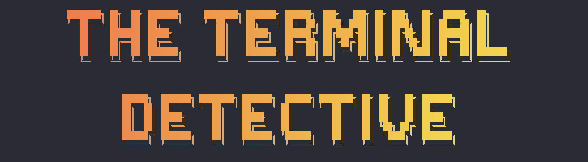

# The Terminal Detective

[](https://opensource.org/licenses/MIT)
[](https://typescriptlang.org/)
[](https://bun.sh/)


> **A terminal-based detective game that teaches essential command-line skills through missions.**

Learn real-world command-line skills by navigating file systems, analyzing evidence, hunting for clues, and solving puzzles.

## Game Features

### **Mission-Based Learning**

- **Progressive Missions** from basic file navigation to advanced system investigation
- **Difficulty Scaling** from beginner-friendly to intermediate challenges
- **Real-World Scenarios** based on actual cybersecurity investigations
- **Interactive Storytelling** with typewriter effects and immersive narratives

### **Progress & Achievement System**

- **Persistent Progress** - Resume your investigation anytime
- **Mission Unlocking** - Complete missions to unlock new challenges
- **Skill Tracking** - See which commands you've mastered
- **Completion Statistics** - Track your detective journey

## Quick Start

```bash
# Prerequisites: Bun installed
git clone https://github.com/aotakeda/the-terminal-detective.git
cd the-terminal-detective
bun install
bun run dev
```

## How to Play

### **Getting Started**

1. **Launch the game** using your preferred method above
2. **Select Mission 1** - "The Missing Files" to begin your training
3. **Read the briefing** to understand your investigation objectives
4. **Use terminal commands** to navigate and investigate
5. **Complete objectives** to progress through the story

### **Mission Structure**

Each mission includes:

- **Story Briefing**: Context and background for your investigation
- **Objectives**: Specific tasks to complete using terminal commands
- **Hints**: Helpful guidance when you're stuck
- **Completion**: Unlock new missions and skills

### Tech Stack

- [Bun](https://bun.sh/) to run the game.

- [Ink](https://github.com/vadimdemedes/ink) to create the terminal UI.

- [TypeScript](https://www.typescriptlang.org/) to type the game.

- [Vitest](https://vitest.dev/) to test the game.